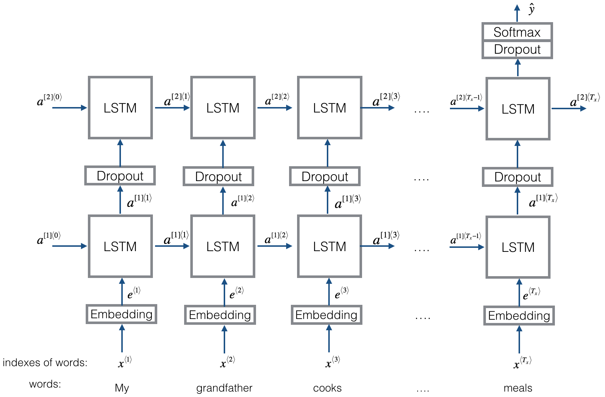

# Emojifier
## Training Mini-Batches using Keras
Most deep learning frameworks require that all sequences in the same mini-batch have the same length. This is what allows vectorization to work: If you had a 3-word sentence and a 4-word sentence, then the computations needed for them are different (one takes 3 steps of an LSTM, one takes 4 steps) so it's just not possible to do them both at the same time. 
The common solution to handling sequences of different length is to use padding. Specifically:
- Set a maximum sequence length
- Pad all sequences to have the same length.
## The Embedding Layer
In Keras, the embedding matrix is represented as a "layer". The embedding matrix maps word indices to embedding vectors.
- The word indices are positive integers.
- The embedding vectors are dense vectors of fixed size.
- When we say a vector is "dense", in this context, it means that most of the values are non-zero. As a counter-example, a one-hot encoded vector is not "dense."

The embedding matrix can be derived in two ways:
- Training a model to derive the embeddings from scratch.
- Using a pretrained embedding.

Using and updating pre-trained embeddings:
First we will initialize the Embedding layer with the GloVe 50-dimensional vectors. Because our training set is quite small, we will leave the GloVe embeddings fixed instead of updating them.

Inputs and outputs to the embedding layer
The ` Embedding() ` layer's input is an integer matrix of size (batch size, max input length).

- This input corresponds to sentences converted into lists of indices (integers).
- The largest integer (the highest word index) in the input should be no larger than the vocabulary size.

The embedding layer outputs an array of shape (batch size, max input length, dimension of word vectors).

The figure shows the propagation of two example sentences through the embedding layer.

- Both examples have been zero-padded to a length of ` max_len=5 `.
- The word embeddings are 50 units in length.
- The final dimension of the representation is ` (2,max_len,50) `.

Building the embedding layer
Let's build the ` Embedding() ` layer in Keras, using pre-trained word vectors.
The embedding layer takes as input a list of word indices.
- ` sentences_to_indices() ` creates these word indices.
The embedding layer will return the word embeddings for a sentence.

### Building the Emojifier model 
We feed the embedding layer's output to LSTM network

The model takes as input an array of sentences of shape ` (m, max_len, ) ` defined by input_shape.

The model outputs a softmax probability vector of shape ` (m, C = 5) `.

You may need to use the following Keras layers:

Input():

- Set the ` shape ` and ` dtype ` parameters.
- The inputs are integers, so you can specify the data type as a string, 'int32'.

LSTM():
- Set the ` units ` and ` return_sequences ` parameters.
Dropout():

- Set the` rate ` parameter.

Dense():

- Set the ` units `,
- Note that` Dense() ` has an activation parameter. For the purposes of passing the autograder, please do not set the activation within ` Dense() `. Use the separate Activation layer to do so.

Activation():

You can pass in the activation of your choice as a lowercase string.

Model Set ` inputs ` and ` outputs `.
